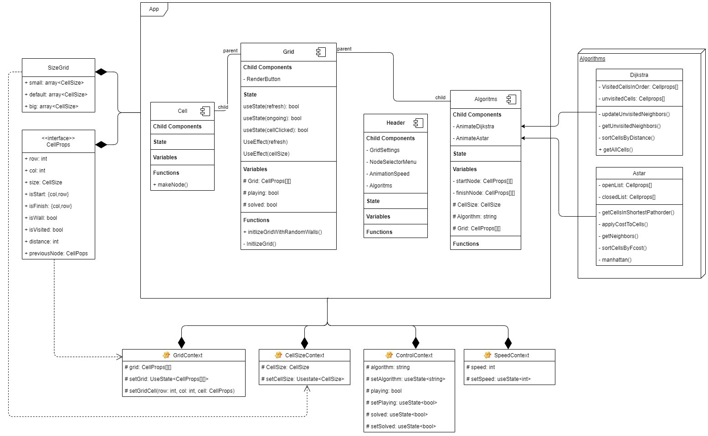

# Pathfinding


## Introduction
Visual showcase of pathfinding algorithms in action!

## Getting Started

These instructions will give you a copy of the project up and running on
your local machine for development and testing purposes.

### Installing

Clone this repository

```
git clone https://github.com/johannes67890/Pathfinding.git
```

Install all the dependencies

```
npm install
```

### Usage
Compile and run program though Vite:
```
npm run dev
```

## UML Component Diagram


